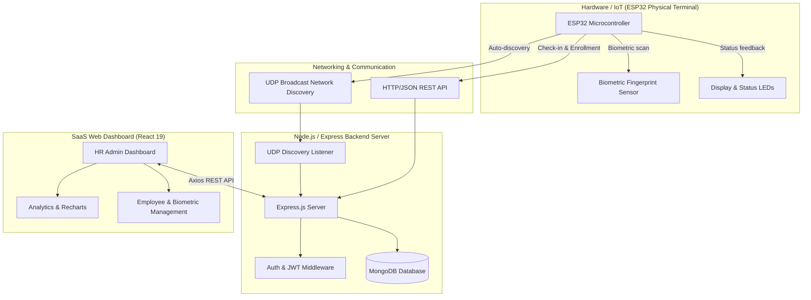
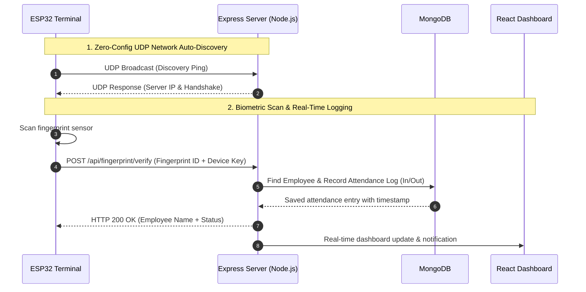

# 🛡️ BioPulse — Intelligent IoT Biometric Attendance System & SaaS Web Platform

[](https://github.com/Mr-Dhia/Attendance-System)
[](https://www.espressif.com)
[](https://react.dev)
[](https://nodejs.org)

**BioPulse** is an enterprise-grade time & attendance tracking platform that seamlessly integrates a **physical IoT biometric terminal (ESP32 micro-controller)** with a **premium dark glassmorphic SaaS web dashboard** (React 19, Express, MongoDB).

---

## 📁 Repository Structure

```text
├── Hardware/                       # ESP32 C++ / Arduino firmware source code
│   └── pointeuse/                  # Hardware modules: fingerprint sensor, TFT/OLED display, LEDs, UDP/HTTP networking
├── application/plateforme/         # Fullstack Web Application
│   ├── backend/                    # Express 5 REST API, MongoDB Mongoose, JWT Auth, UDP Discovery Listener
│   └── attendance-system/          # SaaS Web Dashboard (React 19, Material UI, Tailwind CSS, Recharts)
```

---

## 📸 Overall System Architecture



---

## ⚡ Biometric Check-in Sequence



---

## 💼 Freelance Portfolio Case Study

> **Use this section as a reference case study in freelance proposals and client pitches (Upwork, Malt, LinkedIn).**

### 📌 Context & Business Problem
Modern enterprises require automated, tamper-proof workforce attendance tracking. Manual paper logs or badge sharing lead to inaccuracies, whereas BioPulse provides biometric verification connected directly to a central HR management system.

### 💡 BioPulse Solution
- **Autonomous IoT Terminal**: ESP32 micro-controller featuring an optical fingerprint sensor, status LEDs, and screen notifications.
- **Zero-Config Network Auto-Discovery**: Custom UDP broadcast protocol allowing hardware units to detect the backend server automatically without manual IP configuration.
- **Enterprise Web Platform**:
  - **Real-Time HR Analytics**: Live attendance feed, automated late arrivals, and absence tracking via Recharts charts.
  - **Employee & Department Management**: Web-guided biometric enrollment.
  - **Work Schedules & Shift Assignment**: Custom weekly shifts and grace period tolerance settings.

### 🚀 Technical Stack & Performance
- **Hardware Firmware**: ESP32 C++, Arduino framework, Adafruit Fingerprint Library.
- **Frontend**: React 19, Vite, Material UI (Custom Glassmorphic Theme), Recharts, Tailwind CSS.
- **Backend**: Node.js, Express 5, MongoDB (Mongoose), JWT authentication, Nodemailer.
- **Performance**: Sub-300ms latency from physical fingerprint scan to live web dashboard update.

---

## 🛠️ REST API Specification

| Method | Endpoint | Description | Authentication |
| :--- | :--- | :--- | :--- |
| `POST` | `/api/auth/login` | Administrator login & JWT cookie issue | Public |
| `GET` | `/api/auth/me` | Check active admin session | Cookie Token |
| `GET` | `/api/employees` | List employees with biometric status | Cookie Token |
| `POST` | `/api/fingerprint/enroll` | Trigger web-guided fingerprint enrollment | Device Key / Cookie |
| `POST` | `/api/fingerprint/verify` | Record check-in/out from ESP32 terminal | Device Key |
| `GET` | `/api/dashboard/stats` | Global HR attendance statistics | Cookie Token |

---

## 🚀 Quick Start Guide

### 1. Clone the repository
```bash
git clone https://github.com/Mr-Dhia/Attendance-System.git
cd Attendance-System/application/plateforme
```

### 2. Install & Run
```bash
npm install
cp backend/.env.example backend/.env
npm run dev
```
* **Backend API**: `http://localhost:5000`
* **React Dashboard**: `http://localhost:5173`

---

## 📄 License
This project is open-source and available under the [MIT License](LICENSE).
