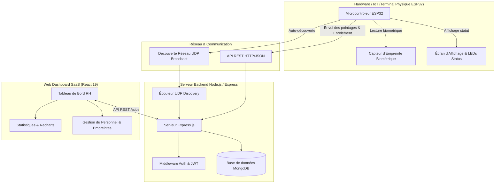
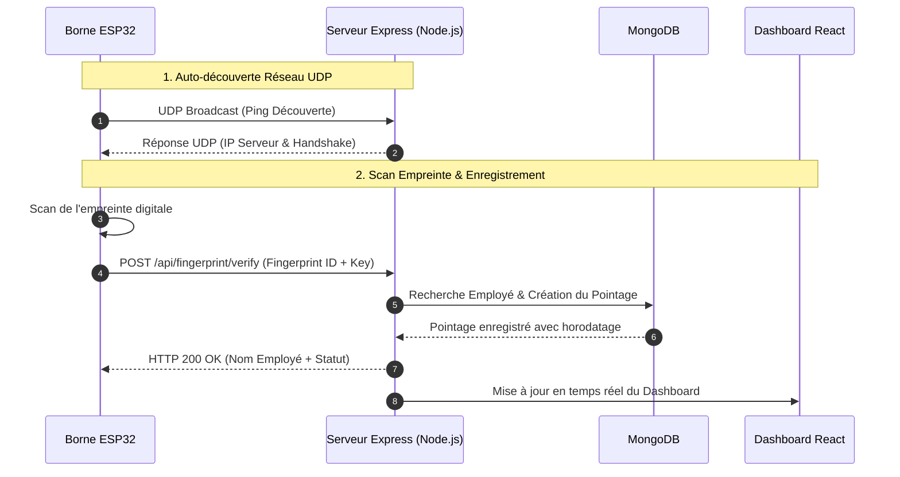

# 🛡️ BioPulse — Système Biométrique IoT & Plateforme Web de Pointage

[](https://github.com/Mr-Dhia/Attendance-System)
[](https://www.espressif.com)
[](https://react.dev)
[](https://nodejs.org)

**BioPulse** est une solution complète de gestion des temps et des présences en entreprise. Elle combine un **terminal de pointage physique IoT (ESP32)** avec capteur biométrique et un **dashboard web SaaS haut de gamme** (React 19, Express, MongoDB).

---

## 📁 Structure du Projet

```text
├── Hardware/                       # Code C++ / Arduino pour le terminal physique ESP32
│   └── pointeuse/                  # Modules : capteur, ecran OLED/TFT, LEDs, réseau UDP/HTTP
├── application/plateforme/         # Solution Web Fullstack
│   ├── backend/                    # API REST Express 5, MongoDB, Authentification JWT, UDP Listener
│   └── attendance-system/          # Dashboard Web SaaS (React 19, Material UI, Tailwind CSS, Recharts)
└── rapport/                        # Documentations et rapport de stage (LaTeX & PDF)
```

---

## 📸 Architecture Globale du Système



---

## ⚡ Séquence de Pointage Biométrique



---

## 💼 Fiche d'Étude de Cas (Portfolio / Freelance Showcase)

> **Présentation du projet pour les propositions de devis et profils freelance (Malt, LinkedIn, Upwork).**

### 📌 Contexte & Problématique
Gestion automatisée des présences en entreprise avec élimination du pointage manuel et sécurisation par identifiants biométriques infalsifiables.

### 💡 Solution Apportée par BioPulse
- **Borne IoT Autonome** : ESP32 + Capteur d'empreintes + Écran d'affichage + Signalisation LED.
- **Auto-Découverte sans configuration** : Protocole UDP propriétaire permettant au terminal de trouver le serveur backend automatiquement.
- **Plateforme Web Enterprise** :
  - **Dashboard analytique** : Présences, retards et absences calculés en temps réel avec graphiques Recharts.
  - **Gestion des employés & Départements** : Enrôlement biométrique guidé depuis le web.
  - **Gestion des plannings** : Plages horaires hebdomadaires et tolérances de retard.

### 🚀 Stack Technologique
- **Hardware** : ESP32, C++ Arduino, Adafruit Fingerprint Sensor.
- **Frontend** : React 19, Vite, Material UI (Custom Glassmorphic Theme), Recharts, Tailwind CSS.
- **Backend** : Node.js, Express 5, MongoDB, JWT, Nodemailer.

---

## 🛠️ Spécification des Endpoints d'API REST

| Méthode | Endpoint | Description | Authentification |
| :--- | :--- | :--- | :--- |
| `POST` | `/api/auth/login` | Connexion Administrateur & Cookie JWT | Publique |
| `GET` | `/api/auth/me` | Vérification de session active | Cookie Token |
| `GET` | `/api/employees` | Liste des employés et statut biométrique | Cookie Token |
| `POST` | `/api/fingerprint/enroll` | Déclenchement de l'enrôlement biométrique | Device Key / Cookie |
| `POST` | `/api/fingerprint/verify` | Enregistrement d'un pointage depuis l'ESP32 | Device Key |
| `GET` | `/api/dashboard/stats` | Métriques et statistiques globales RH | Cookie Token |

---

## 🚀 Guide de Démarrage Rapide

### 1. Cloner le projet
```bash
git clone https://github.com/Mr-Dhia/Attendance-System.git
cd Attendance-System/application/plateforme
```

### 2. Installer & Lancer
```bash
npm install
cp backend/.env.example backend/.env
npm run dev
```
* **Backend API** : `http://localhost:5000`
* **Dashboard React** : `http://localhost:5173`

---

## 📄 Licence
Ce projet est sous licence MIT.
