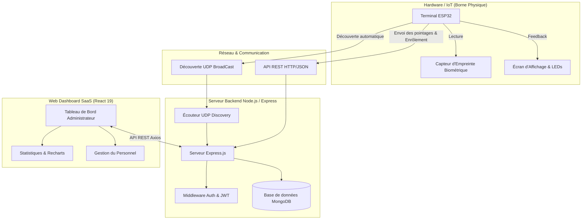
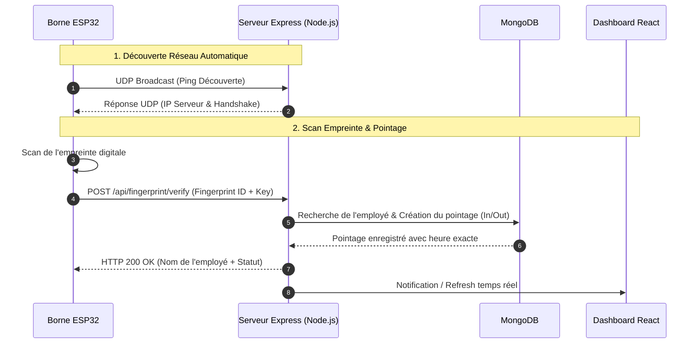

# 🛡️ BioPulse — Système Intelligent de Gestion de Présence & Pointage Biométrique IoT

[](https://github.com)
[](https://react.dev)
[](https://nodejs.org)
[](https://www.espressif.com)

**BioPulse** est une plateforme complète et moderne de gestion des temps et des présences en entreprise. Elle combine un **terminal de pointage physique IoT (ESP32)** équipé d'un capteur biométrique d'empreintes digitales et un **dashboard web SaaS haut de gamme** (React, Express, MongoDB).

---

## 📸 Aperçu de l'Architecture System



---

## ⚡ Flux Biométrique & Découverte Réseau



---

## 💼 Fiche d'Étude de Cas (Portfolio / Freelance Showcase)

> **Vous pouvez utiliser cette section pour présenter ce projet sur votre profil freelance (Malt, LinkedIn, Upwork) ou dans vos propositions commerciales.**

### 📌 Contexte & Problématique
Les entreprises cherchent à automatiser le suivi des présences de leurs collaborateurs, éliminer le pointage manuel sur papier et sécuriser les accès via des identifiants biométriques infalsifiables, tout en disposant d'un tableau de bord clair pour la direction RH.

### 💡 Solution Apportée par BioPulse
- **Pointeuse Matérielle Autonome** : Conçue sur microcontrôleur ESP32 avec capteur biométrique d'empreinte, écran d'affichage TFT/OLED et signaux lumineux LED.
- **Auto-Découverte sans configuration** : Le terminal trouve automatiquement le serveur backend sur le réseau local via un protocole UDP propriétaire.
- **Plateforme Web Enterprise** :
  - **Dashboard analytique** : Taux d'assiduité, présences en temps réel, retards et absences calculés automatiquement.
  - **Gestion complète des employés & départements** : Enrôlement biométrique guidé depuis le web.
  - **Gestion des plannings & horaires** : Attribution d'horaires de travail hebdomadaires et tolérances de retard.

### 🚀 Valeur Ajoutée Technique
- **Stack Moderne** : React 19, Vite, Material UI (Custom Dark Glassmorphic Theme), Node.js, Express, MongoDB.
- **Sécurité** : Authentification par Cookie HTTP-Only + JWT, validation par clé matérielle `DEVICE_KEY`, sanitisation des entrées.
- **Performance** : Temps de réponse biométrique < 300ms entre le scan physique et l'affichage web.

---

## 🛠️ Spécification des Endpoints d'API REST

| Méthode | Endpoint | Description | Authentification |
| :--- | :--- | :--- | :--- |
| `POST` | `/api/auth/login` | Connexion Administrateur & émission de cookie JWT | Publique |
| `GET` | `/api/auth/me` | Vérification de la session active | Cookie Token |
| `GET` | `/api/employees` | Liste complète des employés avec statut biométrique | Cookie Token |
| `POST` | `/api/employees` | Création d'un nouvel employé | Cookie Token |
| `POST` | `/api/fingerprint/enroll` | Déclenchement de l'enrôlement biométrique | Device Key / Cookie |
| `POST` | `/api/fingerprint/verify` | Enregistrement d'un pointage depuis la borne ESP32 | Device Key |
| `GET` | `/api/attendance` | Historique et rapports de présence filtrables | Cookie Token |
| `GET` | `/api/dashboard/stats` | Métriques et statistiques globales pour Recharts | Cookie Token |

---

## 🚀 Guide de Démarrage Rapide

### Prérequis
- **Node.js** v18+ et **npm** v9+
- **MongoDB** (En local `mongodb://127.0.0.1:27017` ou MongoDB Atlas)

### Installation & Lancement

1. **Cloner le dépôt et installer les dépendances** :
   ```bash
   # À la racine du projet
   npm install
   ```

2. **Configurer l'environnement** :
   Copier le fichier d'exemple et ajuster les variables :
   ```bash
   cp backend/.env.example backend/.env
   ```

3. **Lancer le serveur backend & l'application React en simultané** :
   ```bash
   npm run dev
   ```
   * **Backend API** : `http://localhost:5000`
   * **Dashboard React** : `http://localhost:5173`

---

## 📄 Licence
Ce projet est sous licence MIT — Libre d'utilisation et de personnalisation pour des besoins commerciaux ou de portfolio.
